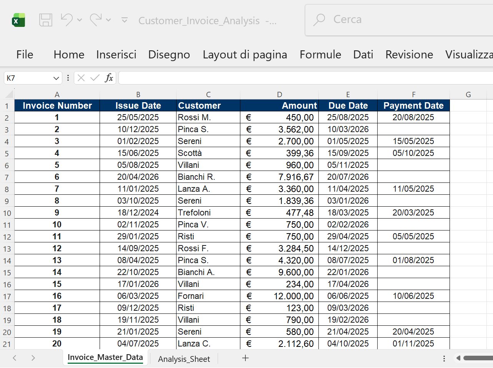
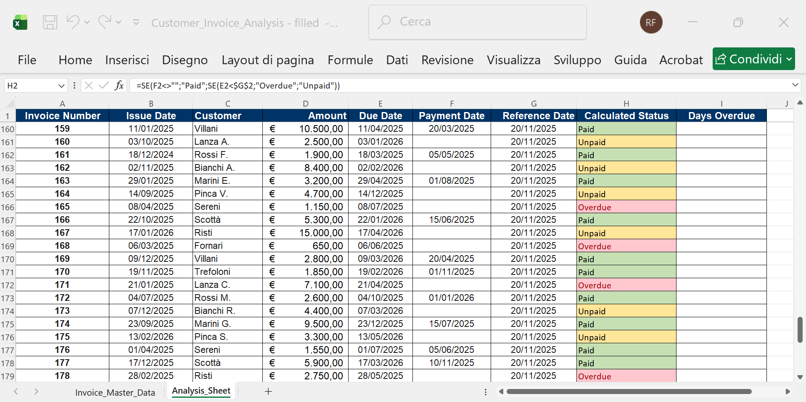
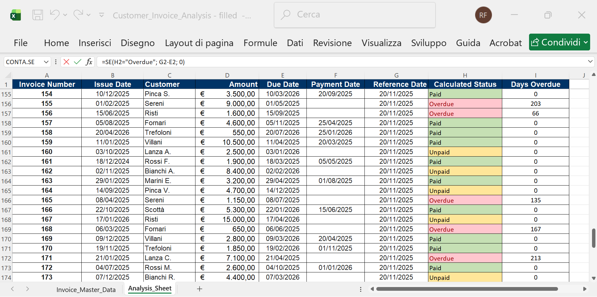
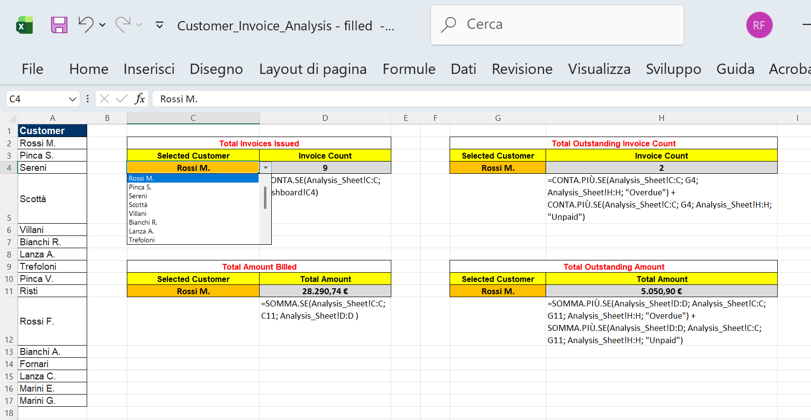

# 🚀 CUSTOMER INVOICE ANALYSIS

This is a **Simulated Financial Analysis Workbook**. All names and data are completely fictitious and generated for demonstration purposes.

The project is structured to separate raw data from calculations. Analysis is based on a fixed reference date of **20/11/2025**.

## 1. 📄 Sheet: `Invoice_Master_Data`

**Role:** The main list of all invoices (Input Data). No formulas.

| Column | Description | Data Type |
| :--- | :--- | :--- |
| **Invoice Number** | Unique ID. | Number |
| **Issue Date** | Invoice creation date. | Date |
| **Customer** | Client name. | Text |
| **Amount** | Total transaction value. | Currency |
| **Due Date** | Payment deadline. | Date |
| **Payment Date** | Actual date payment was received (Manual input). Null if not yet paid. | Date |

*Figure 1: Initial setup of the \`Invoice\_Master\_Data\` sheet, showing all raw input columns.*

---

## 2. 📊 Sheet: `Analysis_Sheet`

**Role:** The work area for all calculations.

| Column | Description | Role |
| :--- | :--- | :--- |
| **A-F** | **Input Columns** | Copied from Master Data for tracing. (A-E are original inputs, F is Payment Date). |
| **G** | **Reference Date** | Fixed comparison date (20/11/2025). |
| **H** | **Calculated Status** | **FORMULA:** Shows if invoice is Paid, Overdue, or Unpaid. It prioritizes the Payment Date (F). |
| **I** | **Days Overdue** | **FORMULA:** Calculates days past due. |

*Figure 2: Setup of the \`Analysis\_Sheet\` showing input columns copied from the Master Data and the added calculation columns (G-I).*

---

## 3. 🧠 Calculation Logic: Calculated Status (Column H)

The core of the financial analysis lies in determining the status of each invoice, documented in the **Calculated Status (Column H)**. The formula used is:

`=IF(F2<>"","PAID",IF(E2<$G$2,"OVERDUE","UNPAID"))`

This formula prioritizes the transaction history over the deadline, operating in a hierarchy:

1.  **Paid Priority:** The system first checks the **Payment Date (Column F)**. If a date exists, the invoice is immediately marked as **PAID**. This status supersedes all other considerations, as the debt has been settled.
2.  **Overdue Check:** If the invoice has not been paid (i.e., Payment Date is null), the formula uses the fixed **Reference Date (Column G)** to check for delinquency. If the **Due Date (Column E)** is earlier than the Reference Date, the invoice is marked as **OVERDUE**.
3.  **Upaid Status:** If the invoice is neither PAID nor OVERDUE, it is marked as **UNPAID**. This means the payment is still expected, but the deadline has not yet been reached relative to the Reference Date.

---

## 4. ✨ Conditional Formatting

To provide a quick visual assessment of the invoice portfolio, Conditional Formatting is applied to the **Calculated Status (Column H)** using three simple rules:

| Condition | Rule | Formatting |
| :--- | :--- | :--- |
| Cell value is equal to `"PAID"` | `=H2="PAID"` | **Green** Fill (Completed transactions) |
| Cell value is equal to `"UNPAID"` | `=H2="UNPAID"` | **Yellow** Fill (Expected items, not yet due) |
| Cell value is equal to `"OVERDUE"` | `=H2="OVERDUE"` | **Red** Fill (Critical items, past due and unpaid) |

This visual system allows analysts to immediately identify critical items (Red), expected items (Yellow), and completed transactions (Green).

*Figure 3: Conditional Formatting applied to the Calculated Status (Column H) for visual assessment of Paid (Green), Unpaid (Yellow), and Overdue (Red) invoices.*

---

## 5. 🗓️ Days Overdue (Column I - Screenshot 4)

The **Days Overdue (Column I)** calculates the number of days a currently unpaid invoice is past its due date. This calculation only applies to invoices marked as **OVERDUE** in Column H.

The formula used is:

`=IF(H2="OVERDUE",$G$2-E2,0)`

* If the status in **Column H** is **OVERDUE**, the formula calculates the difference between the **Reference Date (G)** and the **Due Date (E)**.
* For all other statuses (PAID or UNPAID), the value is set to **0**, as the invoice is either settled or not yet due.

*Figure 4: Display of the "Days Overdue" calculation (Column I), showing the number of days past the due date for critical (Overdue) invoices.*

---

## 6. 📊 Sheet: `Dashboard`

**Role:** The **Dashboard** sheet acts as the primary executive summary and analysis tool. It provides key performance indicators (KPIs) and allows for detailed analysis of a single customer using a dynamic dropdown filter.

---

### 6.1. ⚙️ Setup and Data Validation

The initial setup for the interactive dashboard involves two main steps:

1.  **Unique Customer List:** Copy **Column C (Customer)** from `Invoice_Master_Data` into a dedicated column (e.g., Column A) on the `Dashboard` sheet. Remove duplicates to create the unique list of clients (16 different customers in this simulation).
2.  **Dropdown Menus:** Apply **Data Validation (List)** to the input cells (C4 and G4/C11 and G11), referencing the unique customer list (e.g., `=$A$2:$A$17`) as the data source. This creates the dynamic selection menus.

### 6.2. 📈 Key Performance Indicators (KPI) Formulas

The four KPI panels use conditional counting and summing to retrieve client-specific data based on the customer selected via the dropdown menu.

#### **A. Total Invoices Issued (Cell D4)**

**Objective:** Count the total number of invoices issued for the selected customer.

**FORMULA:**

`=COUNTIF(Analysis_Sheet!C:C, C4)`

**Logic:** Counts how many times the name of the selected customer (C4) appears in the **Customer Column (C)** of the `Analysis_Sheet`.

#### **B. Total Amount Billed (Cell D11)**

**Objective:** Calculate the total monetary value billed to the selected customer, regardless of payment status.

**FORMULA:**

`=SUMIF(Analysis_Sheet!C:C, C11, Analysis_Sheet!D:D )`

**Logic:** Executes a sum on the **Amount Column (D)** of `Analysis_Sheet` if the values in the **Customer Column (C)** are equal to the selected customer (C11). This includes all invoices (Paid, Unpaid, and Overdue).

#### **C. Total Outstanding Invoice Count (Cell H4)**

**Objective:** Count the number of invoices that are still considered "outstanding" (Overdue or Unpaid) for the selected customer.

**FORMULA:**

`=COUNTIFS(Analysis_Sheet!C:C, G4, Analysis_Sheet!H:H, "Overdue") + COUNTIFS(Analysis_Sheet!C:C, G4, Analysis_Sheet!H:H, "Unpaid")`

**Logic:** Uses two `COUNTIFS` functions to sum the count of invoices that satisfy both the Customer criterion (G4) AND the status criterion ("Overdue" or "Unpaid"). The results are summed to find the total outstanding count (excluding "Paid" invoices).

#### **D. Total Outstanding Amount (Cell H11)**

**Objective:** Calculate the total outstanding monetary amount still due from the selected customer (Overdue or Unpaid).

**FORMULA:**

`=SUMIFS(Analysis_Sheet!D:D, Analysis_Sheet!C:C, G11, Analysis_Sheet!H:H, "Overdue") + SUMIFS(Analysis_Sheet!D:D, Analysis_Sheet!C:C, G11, Analysis_Sheet!H:H, "Unpaid")`

**Logic:** Uses two `SUMIFS` functions to sum the **Amount Column (D)** of the invoices that satisfy both the Customer criterion (G11) AND the status criterion ("Overdue" or "Unpaid"). The result is the total **Outstanding Amount** still owed (excluding "Paid" invoices).

*Figure 5: The complete Dashboard sheet, illustrating the unique customer list, the KPI panels, the active dropdown menu, and the visualization of the four primary calculation formulas.*

---
